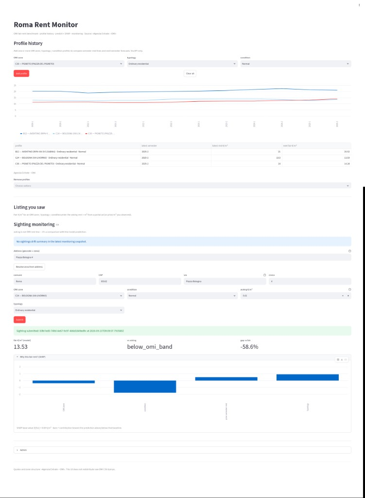
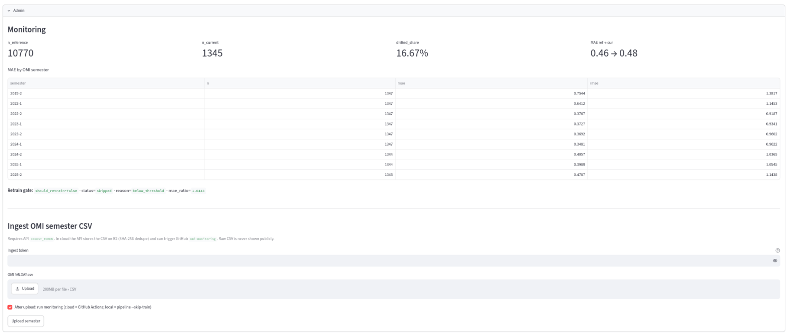

# Rent-tracker

**Roma Rent Monitor** — end-to-end ML product on official OMI fair rent (€/m²/month) for Rome: zone/typology history, next-semester forecast, listing sightings with address→zone, SHAP explainability, and drift/retrain monitoring.

**Portfolio highlights:** FastAPI + Streamlit · geospatial address→zona OMI · model explainability (SHAP) · Evidently drift + retrain gate · DVC/R2 data versioning · Postgres sightings · CI on GitHub Actions · live deploy on Render.

## Demo

**Live UI:** [rent-tracker-ui-service.onrender.com](https://rent-tracker-ui-service.onrender.com)

**Listing sighting + SHAP** — address → zona OMI, asking vs fair €/m², feature contributions.

**Admin monitoring** — drift KPIs, MAE by semester, retrain gate, OMI ingest (R2 + GitHub Actions).

## What it does

Official **OMI** (Agenzia delle Entrate) rent bands for Rome are hard to explore over time or turn into a forward estimate. This repo:

1. Trains a fair €/m² model from OMI semesters (OMI mid target).
2. Serves **FastAPI** + **Streamlit** (history, listing sighting, monitoring).
3. Resolves **address → zona OMI** (Nominatim + point-in-polygon).
4. Compares optional portal asking €/m² vs fair / OMI band (no scraping).
5. Monitors drift and gates retrain; admin ingest via DVC/R2.

## Tech stack

Python **3.12** · scikit-learn · GeoPandas · FastAPI · Streamlit · MLflow · Evidently · SHAP · DVC/R2 · Postgres · Docker · GitHub Actions · Render

## Docs

| Doc | Content |
|-----|---------|
| [`doc/overview.md`](doc/overview.md) | Architecture, metrics, setup, layout |
| [`doc/usage.md`](doc/usage.md) | Commands & local workflow |
| [`doc/omi.md`](doc/omi.md) | OMI data |
| [`doc/render.md`](doc/render.md) | Deploy |
| [`doc/drift.md`](doc/drift.md) · [`doc/dvc.md`](doc/dvc.md) · [`doc/nominatim.md`](doc/nominatim.md) · [`doc/postgres.md`](doc/postgres.md) | Ops topics |
