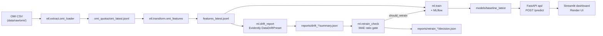

# Rent-tracker

**Roma Rent Monitor** — OMI-based fair rent (€/m²/month) for Rome: profile history by zone segment, next-semester forecasts, and drift/retrain monitoring.

[](https://github.com/SimBoex/Rent-tracker/actions/workflows/ci.yml)

[](LICENSE)

## Demo / live

**Live UI (Streamlit):** [rent-tracker-ui-service.onrender.com](https://rent-tracker-ui-service.onrender.com) — deploy details in [`doc/render.md`](doc/render.md).

<video src="assets/RentTracker.webm" controls width="100%" title="Roma Rent Monitor — Streamlit UI demo">
  <a href="assets/RentTracker.webm">Download the UI walkthrough (WebM)</a>
</video>

*OMI profile history · next-semester fair €/m² forecast · drift / retrain monitoring*

Docs: [`SOR2-roma-rent-monitor.md`](SOR2-roma-rent-monitor.md) · [`doc/omi.md`](doc/omi.md) · [`doc/usage.md`](doc/usage.md) · [`doc/drift.md`](doc/drift.md) · [`doc/render.md`](doc/render.md) · [`doc/dvc.md`](doc/dvc.md) · [`doc/roadmap-learning.md`](doc/roadmap-learning.md) · [`doc/roadmap-naive-sightings-db.md`](doc/roadmap-naive-sightings-db.md).

## Problem and solution

Rome OMI quotes are zone-level €/m²/month ranges by typology and condition, published by semester — useful as an official benchmark, but awkward to explore over time or to turn into a forward estimate. This project loads those quotes, trains a model on the OMI mid, and serves a Streamlit UI for **profile history** (compare zona OMI / tipologia / stato over semesters) plus a **next-semester fair €/m²** forecast and **drift / retrain monitoring**. Source: **OMI Open Data**, Agenzia delle Entrate.

## Architecture

Actual flow (`run_pipeline.py` + monitoring CI):




- **Local:** `run_pipeline.py` = load → features → train (optional `--skip-train` / `--no-mlflow`)
- **CI** (`omi-monitoring`): UI admin upload → API `/ingest/omi` → R2 inbox → `pull_ingest_inbox` → `run_pipeline.py --skip-train` → drift → `retrain_check` (MAE gate) → dashboard snapshots

## Model results

Metrics from `models/baseline_latest/metrics.json` (temporal split = last OMI semester). **Naive** = \(\hat y =\) `loc_mid_lag` (prior-semester mid, same zone × typology × condition); evaluated on test rows with non-null lag.

| Metric | HGB | Naive (`loc_mid_lag`) |
|--------|-----|------------------------|
| **MAE** (€/m²/month) | 0.4892 | **0.4626** |
| **RMSE** | **1.1733** | 1.3588 |
| **R²** | **0.9610** | 0.9477 |
| **N** (zone / typology / condition quotes) | **16 156** | |
| Train / test | 14 811 / 1 345 | |
| Features | `loc_mid_lag`, `zona_omi`, `tipologia`, `stato` | |
| Target | `price_per_m2_monthly` (OMI mid `(LOCMIN+LOCMAX)/2`) | |

On this split the lag-1 naive wins MAE (slow series); HGB still improves RMSE/R² via cross-zone structure.

## Tech stack

- **Python 3.12** (Dockerfile + CI)
- **scikit-learn** — `HistGradientBoostingRegressor` + pipeline
- **pandas**, **joblib**
- **MLflow** — local tracking (`mlflow.db`, experiment `roma-rent-baseline`)
- **FastAPI** + **uvicorn** — serving `/predict` (+ TreeSHAP explainability)
- **Evidently** — `DataDriftPreset` (RF-08)
- **SHAP** — TreeExplainer on HistGradientBoosting (RF-10d)
- **Streamlit** — dashboard (profile history + predict + monitoring)
- **pytest**, **httpx** — tests
- **boto3** — ingest / DVC remote (R2/S3-compatible)
- **Docker** — API image
- **GitHub Actions** — `ci.yml` (pytest), `daily_monitoring.yml` (OMI monitoring)
- **DVC** (+ S3-compatible remote) — sync CSV/features without committing dumps
- **Render** — API (Docker) + UI (Python)

## Setup / Quick start

```bash
python -m venv .venv
source .venv/bin/activate
pip install -r requirements.txt
```

Download OMI CSVs into `data/raw/omi/` (see [`doc/omi.md`](doc/omi.md)), then:

```bash
.venv/bin/python run_pipeline.py -v                             # CSV → features → train
.venv/bin/uvicorn api.main:app --reload --port 8000             # API → http://127.0.0.1:8000/docs
.venv/bin/python -m ml.drift_report -v
.venv/bin/python -m ml.retrain_check --dry-run -v
.venv/bin/streamlit run dashboard/app.py
.venv/bin/python -m pytest -q
docker build -t rent-tracker-api . && docker run --rm -p 8000:8000 rent-tracker-api
```

Predict example (OMI fields):

```bash
curl -s http://127.0.0.1:8000/predict -H 'Content-Type: application/json' -d '{
  "zona_omi": "B12",
  "tipologia": "Abitazioni civili",
  "stato": "NORMALE",
  "loc_mid_lag": 20.0,
  "price_per_m2_monthly": 18.0
}'
```

MLflow UI: `.venv/bin/mlflow ui --backend-store-uri sqlite:///$(pwd)/mlflow.db --port 5000`

## Data drift & retraining

1. **`ml.drift_report`** compares reference vs current (temporal split by semester) with Evidently **`DataDriftPreset`** on features (+ target and `prediction` if the model is present). Writes HTML + `summary.json` under `reports/drift_<ts>/` and `reports/drift_latest/` (includes `mae_reference` / `mae_current` and per-semester MAE).
2. **`ml.retrain_check`** reads that summary: retrains if **`mae_current / mae_reference ≥ 1.5`** and **`n_reference ≥ 50`**. Drifted-column share is context only in `decision.json`, **not** the trigger (see [`doc/drift.md`](doc/drift.md)).
3. The decision lands in `reports/retrain_<ts>/decision.json` and `reports/retrain_latest/`; if not `--dry-run` and `should_retrain`, it calls `ml.train` and updates `models/`. In CI (`omi-monitoring`) the same gate can commit `baseline_latest` when it fires.

## Repository layout

```text
Rent-tracker/
├── api/                 # FastAPI: /health, /predict, deal_label (OMI band or ±10%), optional OMI band
├── dashboard/           # Streamlit UI (local + Render) → calls the API
├── data/                # raw/omi (gitignored CSVs, DVC) + processed features JSONL
├── doc/                 # usage, omi, drift, render, dvc
├── etl/                 # omi_loader + omi_features (+ JSONL/semester helpers)
├── ml/                  # train, temporal split, drift_report, retrain_check, features
├── models/              # baseline_<ts>/ and baseline_latest/ (joblib + metrics)
├── reports/             # drift, retrain, monitoring snapshots
├── tests/               # pytest (API, OMI, drift, retrain, split, dashboard)
├── .github/workflows/   # ci.yml + daily_monitoring.yml (omi-monitoring)
├── run_pipeline.py      # orchestrator: load → features → train
├── Dockerfile           # API image (Python 3.12-slim + model)
└── requirements.txt     # runtime / CI dependencies
```

| Path | Role |
|------|------|
| `api/` | Serving: loads `models/baseline_latest`, predicts fair €/m², optional gap vs asking |
| `data/` | OMI inputs and processed features (raw/processed via DVC, not in public git) |
| `doc/` | Operational guides aligned with current code |
| `etl/` | OMI CSV ingest → JSONL → feature engineering (`loc_mid_lag`, mid target) |
| `ml/` | Training, dataset fingerprint, Evidently drift, retrain gate |
| `models/` | Model artifacts + `metrics.json` / `dataset.json` |
| `tests/` | Unit suite run by GitHub Actions `ci` |
| `dashboard/` | Profile history / Monitoring UI (via API) |
| `reports/` | Drift/retrain outputs and public aggregate snapshots |
