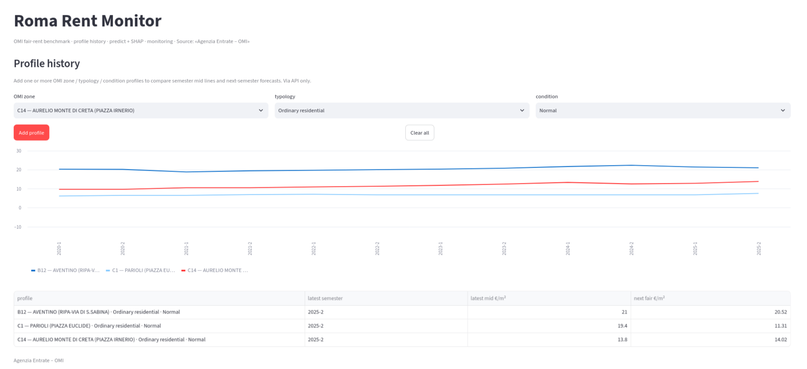
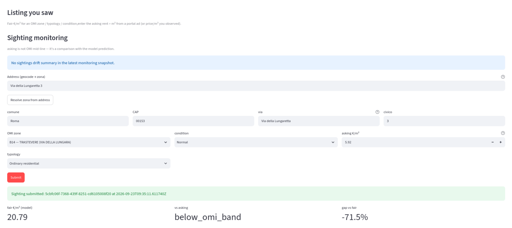
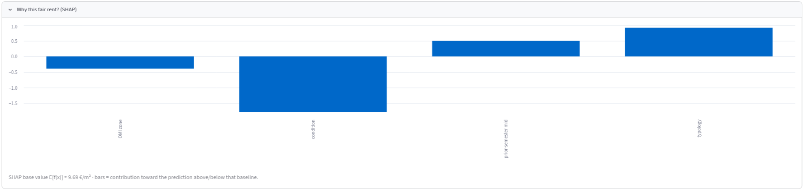
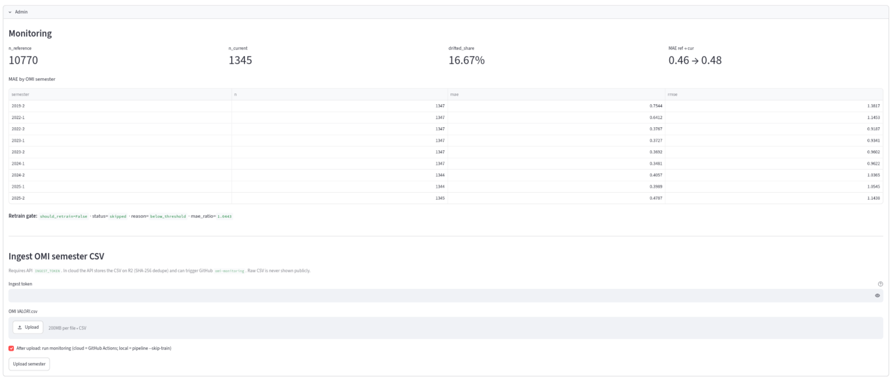

# Rent-tracker

**Roma Rent Monitor** — end-to-end ML product on official OMI fair rent (€/m²/month) for Rome: zone/typology history, next-semester forecast, listing sightings with address→zone, SHAP explainability, and drift/retrain monitoring.

[](https://github.com/SimBoex/Rent-tracker/actions/workflows/ci.yml)

[](LICENSE)

**Portfolio highlights:** FastAPI + Streamlit · geospatial address→zona OMI · TreeSHAP explainability · Evidently drift + MAE retrain gate · offline model selection (MLflow nested runs) · time-series challengers without a second ETL · DVC/R2 data versioning · Postgres sightings · CI on GitHub Actions · live deploy on Render.

## Demo

**Live UI:** [rent-tracker-ui-service.onrender.com](https://rent-tracker-ui-service.onrender.com)

**Profile history** — compare OMI zone / typology / condition mid lines and next-semester fair €/m².



**Listing you saw** — address → zona OMI, submit a sighting, asking vs fair / OMI band.



**SHAP explainability** — feature contributions toward the fair €/m² prediction.



**Admin monitoring** — drift KPIs, MAE by semester, retrain gate, OMI ingest (R2 + GitHub Actions).



## What it does

Official **OMI** (Agenzia delle Entrate) rent bands for Rome are hard to explore over time or turn into a forward estimate. This repo:

1. Trains a fair €/m² model from OMI semesters (OMI mid target).
2. Serves **FastAPI** + **Streamlit** (history, listing sighting, monitoring).
3. Resolves **address → zona OMI** (Nominatim + point-in-polygon).
4. Compares optional portal asking €/m² vs fair / OMI band (no scraping).
5. Monitors drift and gates retrain; admin ingest via DVC/R2.

## ML / MLOps (current state)

Designed as a **portfolio-grade** loop: experiments offline, production recipe explicit, serve contract stable.

| Piece | Choice |
|-------|--------|
| **Serve champion** | `HistGradientBoosting` via `champion_factory()` → `models/baseline_latest` |
| **Train for serve** | Holdout metrics on last semester, then **refit on all rows** (`holdout_then_refit_full`) |
| **Offline selection** | Nested MLflow runs per family (`roma-rent-hgb-optimization`, …) — **not** in CI |
| **Promote** | Manual edit of champion config → `ml.train` → commit artifact (no auto-best from MLflow) |
| **Retrain gate** | Same champion recipe; MAE-only; never re-runs grid / ARIMA |

**Panel selection takeaway:** lag-1 **naive** often wins **MAE**; HGB still wins **RMSE/R²** via cross-zone structure. Naive stays a baseline — serve keeps HGB (tabular API + TreeSHAP).

**Time-series challengers (opzione C):** same `features_latest.jsonl`, reshape to series `(zona_omi, tipologia, stato)` in reading — no second ETL. Offline SES / fixed-order ARIMA vs naive on the last semester.

| Challenger | Result (clean series mask) | Promote? |
|------------|----------------------------|----------|
| Naive (last mid) | Best MAE (~0.30) | No (not the product predictor) |
| SES | ≈ naive after deduping ambiguous OMI keys | No |
| ARIMA (fixed order) | Worse MAE; many non-convergences at N≈24 | No |

With ~24 OMI semesters per key, persistence dominates: classical TS adds little beyond lag-1. SES / ARIMA (orders tried, why (0,1,0)=naive): [`doc/temporal.md`](doc/temporal.md).

```bash
# Panel grid (example)
.venv/bin/python -m ml.selection.select_models --architecture hgb --notes portfolio-run

# Series challengers (same features file)
.venv/bin/python -m ml.selection.select_ses --notes portfolio-run
.venv/bin/python -m ml.selection.select_arima --order 1,0,0 --notes portfolio-run
```

## Tech stack

Python **3.12** · scikit-learn · statsmodels · GeoPandas · FastAPI · Streamlit · MLflow · Evidently · SHAP · DVC/R2 · Postgres · Docker · GitHub Actions · Render

## Docs

| Doc | Content |
|-----|---------|
| [`doc/overview.md`](doc/overview.md) | Architecture, metrics, setup, layout |
| [`doc/usage.md`](doc/usage.md) | Commands & local workflow |
| [`doc/temporal.md`](doc/temporal.md) | SES & ARIMA challengers (equations + runs) |
| [`doc/omi.md`](doc/omi.md) | OMI data |
| [`doc/render.md`](doc/render.md) | Deploy |
| [`doc/drift.md`](doc/drift.md) · [`doc/dvc.md`](doc/dvc.md) · [`doc/nominatim.md`](doc/nominatim.md) · [`doc/postgres.md`](doc/postgres.md) | Ops topics |
